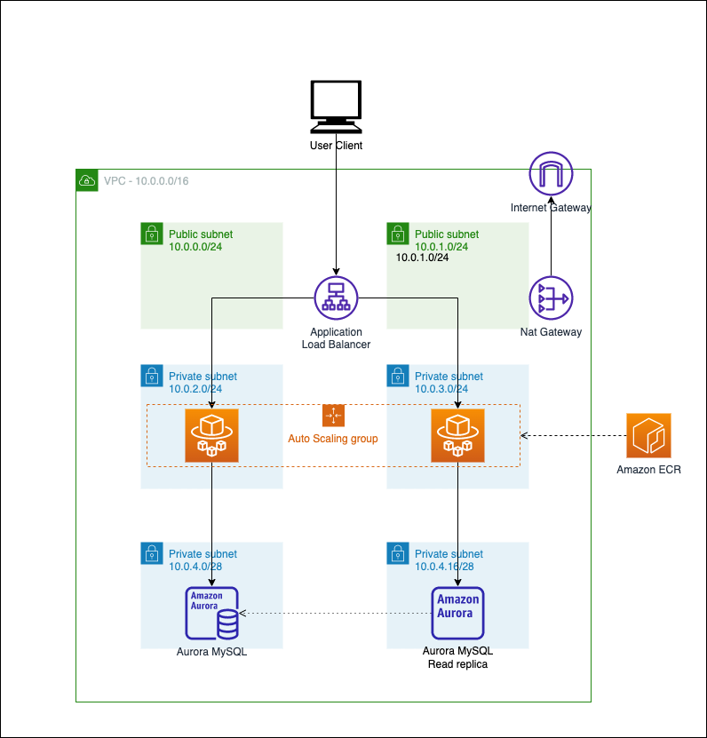

# EDA Workshop CDK for Coffee application


The `cdk.json` file tells the CDK Toolkit how to execute your app.

## Useful commands

* `npm run build`   compile typescript to js
* `npm run watch`   watch for changes and compile
* `npm run test`    perform the jest unit tests
* `cdk diff`        compare deployed stack with current state
* `cdk synth`       emits the synthesized CloudFormation template
* `cdk deploy`      deploy this stack to your default AWS account/region


# Architecture Diagram



# Deploy stacks for workshop
### 1. Set AWS Profile

### 2. Deploy VPC, Database, ECR

Deploy VPC, Database, ECR to AWS cloud.

It takes about 15 minutes. Please go to step 3 while cdk deploying the resources.

```
cdk deploy stack-1-infra
```

### 3. Push docker images in sample-eda-spring application sourcecode. 

Use cli commands in README.md of Sample Coffee Application.

It takes about 3 minutes.

https://github.com/SeoyeonPark/sample-eda-spring

### 4. Deploy ECS Cluster, Task Definition, ALB

After you build docker image and push it to Amazon ECR that created in the above step, then deploy ECS stack to the AWS cloud.

It takes about 5 minutes.

```
cdk deploy stack-2-ecs
```

# Clean up

1. Delete CloudFormation stack
```
cdk destroy --all
```

2. Manually delete Amazon ECR repository. This cli also delete all images in the repository.

```
aws ecr delete-repository --force --repository-name eda-sample-coffee-app
```

